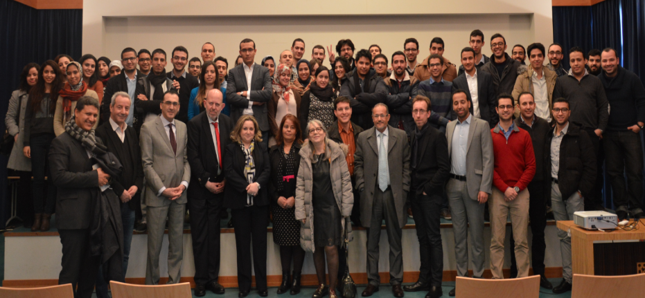

.. Guide pas à pas documentation master file, created by
   sphinx-quickstart on Fri Jul 10 15:29:40 2020.
   You can adapt this file completely to your liking, but it should at least
   contain the root `toctree` directive.

Félicitation !
==============

Cher(e) camarade(e),
Comme une centaine d’EHTPistes accueillis chaque année en France, tu as décidé de t’installer en
France pour enrichir tes connaissances et t’ouvrir à d’autres cultures.

Nous, EHTPistes de France, tenons à te féliciter pour ton choix courageux de venir nous rejoindre,
« nous étions également dans la même situation que la tienne, il y a à peine quelques années de
cela, donc pas de panique, nous serons là à tes côtés pour te conseiller et t’aider lors de tes
premières étapes. A très bientôt sur l’hexagone. »

Réalisation et contact
======================

Le guide « Pas à pas en France » a été réalisé par les EHTPistes de France représentés par
l’association AIEHTP-France ©.

Pour toutes suggestions et remarques merci de contacter l’association par courriel à l’adresse
suivante : aiehtp.france@gmail.com

Acronymes
=========

- **AIEHTP-France** : Association des Ingénieurs de l’Ecole Hassania des Travaux Publics en France
- **APL** : Aide Personnalisée au Logement
- **APS** : Autorisation Provisoire de Séjour
- **CAF** : Caisse d’Allocations Familiales
- **CPAM** : Caisse Primaire d’Assurance Maladie
- **CROUS** : Centre Régional des Œuvres Universitaires et Scolaires
- **CMU-C** : Couverture maladie universelle complémentaire
- **DD** : Double diplôme
- **ECTS** : European Credit Transfert System
- **Ile** de France : Région en France métropolitaine incluant la ville de Paris et des départements qui l’entourent
- **OFII** : Office français de l’immigration et de l’insertion
- **RATP** : Régie autonome des transports parisiens
- **RER** : Réseau express régional
- **REX** : Retour d&#39;expérience
- **SMIC** : Salaire minimum interprofessionnel de croissance
- **TER** : Transport express régional
- **TGV** : Train à grande vitesse
- **TDS** : Titre de séjour
- **UE** : Union européenne
- **VLS-TS** : Visa long séjour valant un titre de séjour

.. toctree::
   :caption: L'AIEHTP-France

   aiehtp/intro
   aiehtp/reseau

